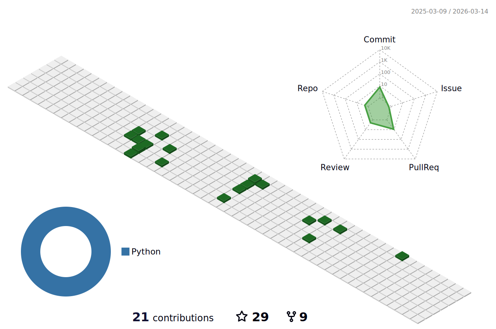

### Hi there 👋



 

[](https://github.com/anuraghazra/github-readme-stats)


 

<!--START_SECTION:waka-->


**🐱 My GitHub Data** 

> 📦 291.1 kB Used in GitHub's Storage 
 > 
> 🏆 200 Contributions in the Year 2024
 > 
> 🚫 Not Opted to Hire
 > 
> 📜 11 Public Repositories 
 > 
> 🔑 50 Private Repositories 
 > 
**I'm a Night 🦉** 

```text
🌞 Morning                272 commits         ███░░░░░░░░░░░░░░░░░░░░░░   13.68 % 
🌆 Daytime                651 commits         ████████░░░░░░░░░░░░░░░░░   32.75 % 
🌃 Evening                731 commits         █████████░░░░░░░░░░░░░░░░   36.77 % 
🌙 Night                  334 commits         ████░░░░░░░░░░░░░░░░░░░░░   16.80 % 
```
📅 **I'm Most Productive on Wednesday** 

```text
Monday                   296 commits         ████░░░░░░░░░░░░░░░░░░░░░   14.89 % 
Tuesday                  465 commits         ██████░░░░░░░░░░░░░░░░░░░   23.39 % 
Wednesday                492 commits         ██████░░░░░░░░░░░░░░░░░░░   24.75 % 
Thursday                 238 commits         ███░░░░░░░░░░░░░░░░░░░░░░   11.97 % 
Friday                   320 commits         ████░░░░░░░░░░░░░░░░░░░░░   16.10 % 
Saturday                 121 commits         ██░░░░░░░░░░░░░░░░░░░░░░░   06.09 % 
Sunday                   56 commits          █░░░░░░░░░░░░░░░░░░░░░░░░   02.82 % 
```


📊 **This Week I Spent My Time On** 

```text
🕑︎ Time Zone: Asia/Shanghai

💬 Programming Languages: 
No Activity Tracked This Week

🔥 Editors: 
No Activity Tracked This Week

💻 Operating System: 
No Activity Tracked This Week
```


 Last Updated on 12/09/2024 00:40:37 UTC
<!--END_SECTION:waka-->
