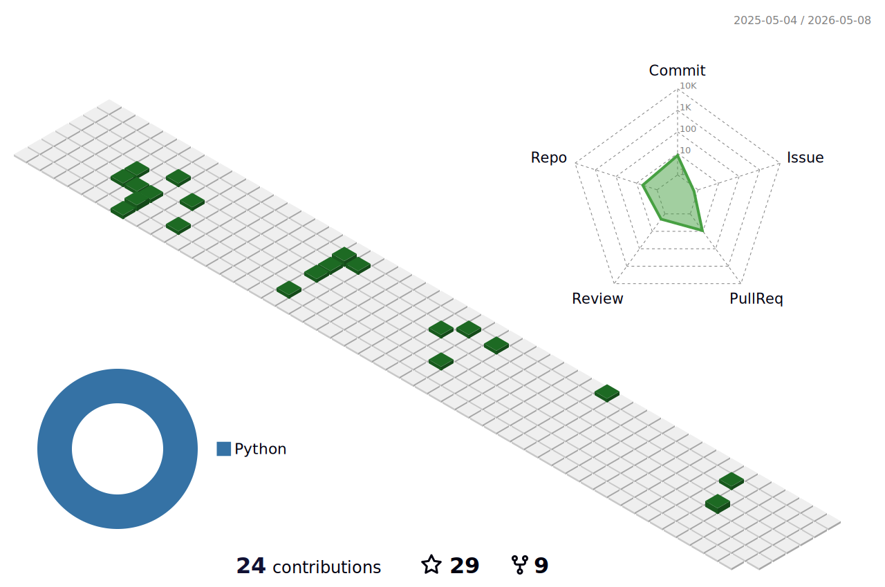

### Hi there 👋



 

[](https://github.com/anuraghazra/github-readme-stats)


 

<!--START_SECTION:waka-->


**🐱 My GitHub Data** 

> 📦 292.0 kB Used in GitHub's Storage 
 > 
> 🏆 0 Contributions in the Year 2026
 > 
> 🚫 Not Opted to Hire
 > 
> 📜 12 Public Repositories 
 > 
> 🔑 51 Private Repositories 
 > 
**I'm an Early 🐤** 

```text
🌞 Morning                304 commits         ████░░░░░░░░░░░░░░░░░░░░░   14.21 % 
🌆 Daytime                827 commits         ██████████░░░░░░░░░░░░░░░   38.64 % 
🌃 Evening                768 commits         █████████░░░░░░░░░░░░░░░░   35.89 % 
🌙 Night                  241 commits         ███░░░░░░░░░░░░░░░░░░░░░░   11.26 % 
```
📅 **I'm Most Productive on Wednesday** 

```text
Monday                   322 commits         ████░░░░░░░░░░░░░░░░░░░░░   15.05 % 
Tuesday                  424 commits         █████░░░░░░░░░░░░░░░░░░░░   19.81 % 
Wednesday                570 commits         ███████░░░░░░░░░░░░░░░░░░   26.64 % 
Thursday                 289 commits         ███░░░░░░░░░░░░░░░░░░░░░░   13.50 % 
Friday                   349 commits         ████░░░░░░░░░░░░░░░░░░░░░   16.31 % 
Saturday                 130 commits         ██░░░░░░░░░░░░░░░░░░░░░░░   06.07 % 
Sunday                   56 commits          █░░░░░░░░░░░░░░░░░░░░░░░░   02.62 % 
```


📊 **This Week I Spent My Time On** 

```text
🕑︎ Time Zone: Asia/Shanghai

💬 Programming Languages: 
No Activity Tracked This Week

🔥 Editors: 
No Activity Tracked This Week

💻 Operating System: 
No Activity Tracked This Week
```


 Last Updated on 10/03/2026 01:01:18 UTC
<!--END_SECTION:waka-->
